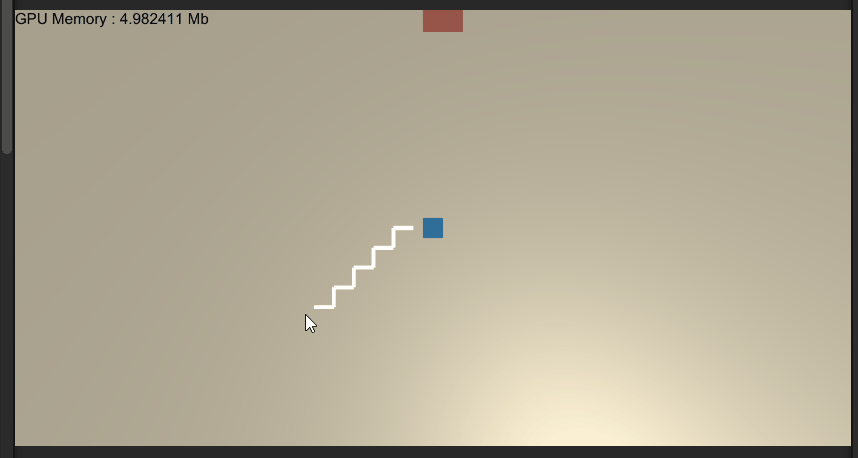

# PathfindInGpu

v1. Can One AI Find Path.

#next feature

amount of AI (10000) can find path with no frame down

study record 

https://www.evernote.com/l/ArDRY4yJeYZGGJbhnZjCzqmGhFiq7eM09y0/

test: is dispatch async? sync get data. 
result: when you called getbuffer that main thread will wait until can get data

https://www.evernote.com/l/ArCtnd7aYGNOLKs6y-EjcO0uvLHNk9_wqlg
