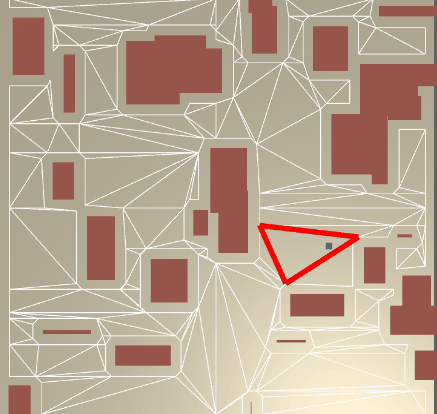

# PathfindInGpu

## Now v2 Feature  
- quad tree ! 
- path determin where is low cost in gpu many character async ! 

## v1 feture finished  
- it find path with tile style 
- not nav mesh
- this version, just for study about Compute Shaders
- ^^

v1. Can One AI Find Path.

## next feature
amount of AI (10000) can find path with no frame down

## study record   
https://www.evernote.com/l/ArDRY4yJeYZGGJbhnZjCzqmGhFiq7eM09y0/  

## test: is dispatch async? sync get data. 
result: when you called getbuffer that main thread will wait until can get data  
https://www.evernote.com/l/ArCtnd7aYGNOLKs6y-EjcO0uvLHNk9_wqlg  

## use
hlsl  
direct compute  
gpgpu knowledge  

## It Use Submodule  

git submodule update --recursive

or:

git pull --recurse-submodules
